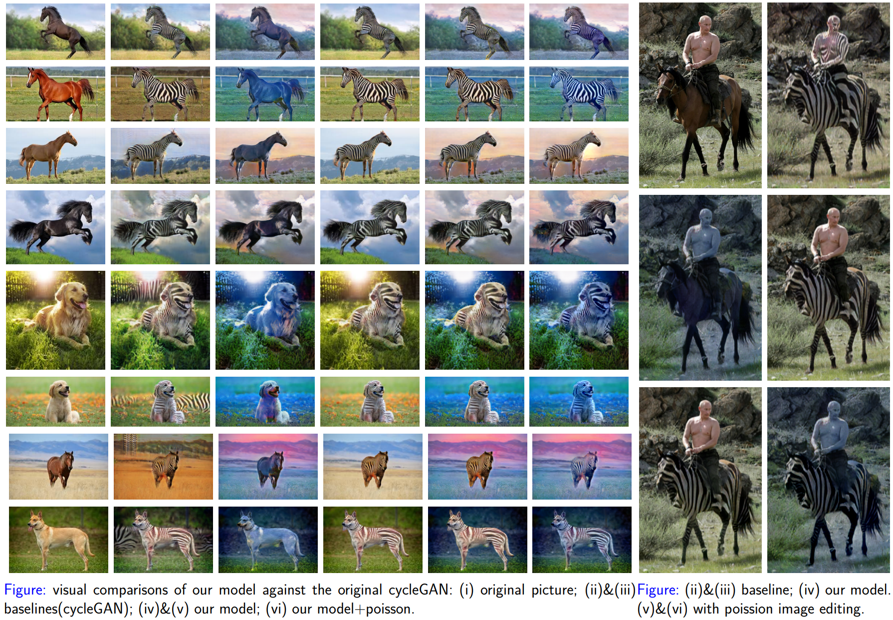

# Image Segmentation Enhanced Style Transfer

We have provided the Pytorch Implementation for our course project **Image Segmentation Enhanced Style Transfer**. We have used Image Segmentation to help us improve the performance of conventional Style Transfer, especially for problem that the elements within the picture will interfere with each other.  

The Implementation is based on [CycleGAN Pytorch](https://github.com/junyanz/pytorch-CycleGAN-and-pix2pix). We have added the part in [Image Segmentation](https://github.com/RL-WWW/ISST/tree/main/segmentation) and several new files under the root repository, which is the key element to our image segmentation enhancing.

The poster of our project is in [ISST](https://github.com/RL-WWW/ISST/tree/main/ISST.pdf).

## Experimental Results



&nbsp;
## Getting Started
The process of our proposed ISST contains two essential parts:  
(1) Image Segmentation. We directly used the pretrained model from [FastFCN](https://github.com/wuhuikai/FastFCN) You can download the models from [checkpoint](https://rec.ustc.edu.cn/share/7018a790-4108-11eb-88ad-2bd0a4833268) and then put them into the folder `checkpoint`.  
(2) Style Transfer for each segmentation. For simplicity, we used the pretrained model `horse2zebra_pretrained` and `winter2summer_yosemite_pretrained` from [CycleGAN Pytorch](https://github.com/junyanz/pytorch-CycleGAN-and-pix2pix). These models should also be put in the folder `checkpoint`. You can download the checkpoint using the following command(from CycleGAN).
```bash
bash ./scripts/download_cyclegan_model.sh horse2zebra
```
- The pretrained model is saved at `./checkpoints/{name}_pretrained/latest_net_G.pth`. Check [here](https://github.com/junyanz/pytorch-CycleGAN-and-pix2pix/blob/master/scripts/download_cyclegan_model.sh#L3) for all the available CycleGAN models.

After downloading these two models, you can directly run the following command:
```python
python ISST.py --image $path_to_image --target_path $path_to_results
```
After the program is finished, there will be six images in the `target_path` folder:


| File_name                                     | meaning                                                      |
| --------------------------------------------- | ------------------------------------------------------------ |
| xxx_fakehorse2zebra_pretrained.png            | Baseline1: fake picture from pretrained model 1              |
| xxx_fakewinter2summer_yosemite_pretrained.png | Baseline2: fake picture from pretrained model 2              |
| xxx_fake0.png                                 | ISST result 1 with animal from pretrained model 1            |
| xxx_fake1.png                                 | ISST result 2 with animal from pretrained model 1 </br>and background from pretrained model 2 |
| xxx_fakepoisson0.png                          | ISST result 3: poisson editing on xxx_fake0.png              |
| xxx_fakepoisson1.png                          | ISST result 4: poisson editing on xxx_fake1.png              |

Besides, you can also use L0-smooth (from the paper: Image Smoothing via $L_0$ Gradient Minimization) before image segmentation, which sometimes will help with the segmentation quality. With the following command, L0-smooth will be added. 
```python
python ISST.py --image $path_to_image --target_path $path_to_results --with_L0
```
As we can see in the results, our proposed methods have significantly improve the performance of CycleGAN, especially in the elements apart from the main animal.